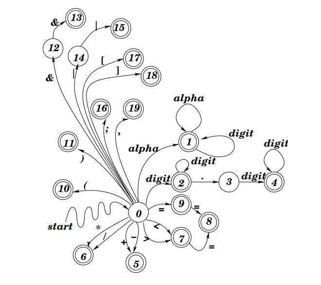

# Three-Part Parser Project
> <i>From Tokens to Execution: Building a Parser Step by Step</i>


Composed of three separate projects done at Lindenwood University. Below is a break down of each projects contents:

To clone this repository enter this command below to clone it to your local machine:

``` 
git clone https://github.com/MaxHoffman05/ParserProject
```


## <a href="./Project1StateDiagram/">Project 1 - Creating a State Diagram</a>

The first project's goal was to create a state diagram based on the statediagram pictured below. main.cpp and Token.hpp were provided code and not changed. Part of Token.cpp was provided but the main goal of this project was to complete the get method which was in charge of reading the next token.

The main thing I learned in this project was how to represent state diagrams in code.

<center>
    
</center>

## <a href="./Project2Grammar/">Project 2 - Creating a Grammar Ruleset</a>

The second project built on the last project's code so it had the same state diagram rules. In this project we were given a set of grammar rules to follow. A grammar rule is a type of way to show which tokens can be in which order. Each grammar rule is above each function in Grammar.cpp. The way a file is checked to be a valid input is to call program() which recursively calls all the other functions to check to see if the tokens are in the correct syntax. This grammar ruleset was based on a left associated parser which we learned about the different types in class. I really enjoyed this project because it built upon the last and it taught me how programs are parsed. 


In this project I learned:

- More applications of recursion
- How to define grammar methods based on plain text provided by my professor
- How left and right associated parsers function

## <a href="./Project3MemoryManager/">Project 3 - Creating a Memory Manager</a>

The final project built on the past project as well. This project we then had to implement new code to allocate memory and store information in variables. In other words, convert this language into a simple functioning language that could store information. An example test file is included to see what the program expects.

In the last part of this multi part project I learned:

- How to implement my existing code and turn it into a functional "language"
- How to represent allocated memory
- How to develop many test cases and use test cases provided to narrow down any bugs found


## Summary 
I really enjoyed working on these projects and this was the first and only project during my time at school that built upon each other. I thought it was very satisfying seeing the finished project 3 knowing I wrote the majority of this code for each project.

If you have any questions on the project let me know!